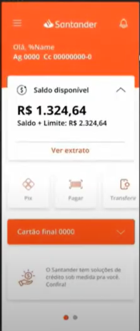

# Santander Dev Week - Tela Inicial do App Santander com Flutter

<div align="center">
<a href="https://github.com/oliveiradg" target="__blank"></a>
</div>


## Descrição
Este é um projeto desenvolvido durante a Santander Dev Week, focado na construção da tela inicial do aplicativo Santander utilizando o framework Flutter com a linguagem Dart. O objetivo é aprofundar o conhecimento em Flutter e destacar alguns conceitos importantes para o desenvolvimento de aplicativos nativos multiplataforma eficientes e atraentes.

<div align="center">
<a href="https://github.com/oliveiradg" target="__blank"></a>
</div>

## Conceitos Destacados

### Flutter
Flutter é um framework open-source do Google para desenvolvimento de aplicativos nativos de alta qualidade para Android, iOS, web e desktop a partir de uma única base de código. Ele oferece uma abordagem reativa para a construção da interface do usuário e é conhecido por sua velocidade, desempenho e flexibilidade.

### Dart
Dart é a linguagem de programação usada pelo Flutter. É uma linguagem moderna, desenvolvida pelo Google, que se assemelha a JavaScript, mas com recursos adicionais para facilitar o desenvolvimento de aplicativos complexos. É fortemente tipada e tem um ciclo de compilação rápido.

### Widgets
Em Flutter, tudo é um widget! Widgets são os blocos de construção fundamentais da interface do usuário e podem ser componentes simples, como texto ou botões, ou até mesmo componentes mais complexos, como listas e telas inteiras. A construção da interface do usuário é feita com base na composição de widgets.

### Estado do Aplicativo
Flutter adota uma abordagem reativa para lidar com o estado do aplicativo. A interface do usuário é reconstruída automaticamente quando o estado muda, garantindo uma experiência de usuário fluida. O gerenciamento do estado pode ser feito usando diversos métodos, como Stateful Widgets ou gerenciadores de estado externos.

### Hot Reload
O recurso de Hot Reload é uma das principais vantagens do Flutter. Permite que você veja instantaneamente as mudanças feitas no código refletidas na interface do aplicativo, acelerando significativamente o processo de desenvolvimento e teste.

## Instalação e Execução
Para executar o projeto, siga os passos abaixo:

1. Certifique-se de ter o Flutter instalado em sua máquina. Caso ainda não tenha, siga as instruções em: [https://flutter.dev/docs/get-started/install](https://flutter.dev/docs/get-started/install)

2. Clone este repositório para sua máquina local:
```
git clone https://github.com/oliveiradg/santander-dev-week-flutter.git
```

3. Navegue até a pasta do projeto:
```
cd santander-dev-week-flutter
```

4. Execute o aplicativo com o seguinte comando:
```
flutter run
```

## Contribuição
Contribuições são bem-vindas! Se você quiser contribuir para o projeto, siga os passos abaixo:

1. Fork do repositório
2. Crie um branch para sua feature (`git checkout -b feature/sua-feature`)
3. Faça suas modificações
4. Faça um commit de suas mudanças (`git commit -m 'Adicionando sua-feature'`)
5. Faça push para o branch (`git push origin feature/sua-feature`)
6. Abra um Pull Request

## Licença
Este projeto está licenciado sob a MIT License - veja o arquivo [LICENSE](LICENSE) para detalhes.

---

Desenvolvido com 💙 por [JBOliveira](https://github.com/oliveiradg) durante a Santander Dev Week.